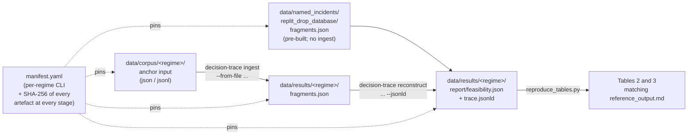

# Anchor-Level Reconstructability Pilot

[](https://github.com/agent-runtime-evidence/anchor-level-reconstructability-pilot/actions/workflows/verify.yml)
[](https://arxiv.org/abs/2605.12078)
[](https://doi.org/10.5281/zenodo.20077961)
[](LICENSE)

Reproducibility artefact for the arXiv preprint
**"Property-Level Reconstructability of Agent Decisions: An Anchor-Level Pilot Across Vendor SDK Adapter Regimes"** (Solozobov, 2026), [arXiv:2605.12078](https://arxiv.org/abs/2605.12078), DOI [`10.48550/arXiv.2605.12078`](https://doi.org/10.48550/arXiv.2605.12078).

This repository pins the inputs and outputs that populate the per-property by per-regime reconstructability matrix (Table 2 of the manuscript) and the strict-score descriptive summary (Table 3 of the manuscript). It is a **standalone reproducibility package**, not the implementation of the Decision Trace Reconstructor or the Operational Evidence Plane — both are referenced as separate Apache-2.0 repositories with content-addressed Zenodo deposits (see [`manifest.yaml`](manifest.yaml)).

## TL;DR — verify in 30 seconds

```bash
git clone https://github.com/agent-runtime-evidence/anchor-level-reconstructability-pilot.git
cd anchor-level-reconstructability-pilot
bash scripts/verify_all.sh
# Expected: All Tier A checks passed.
```

The harness ensures the pinned regenerator dependency is available, verifies SHA-256 of every pinned release artefact (45 files), runs the regenerator with built-in checksum verification, and byte-diffs the output against [`reference_output.md`](reference_output.md). A non-zero exit or missing final `All Tier A checks passed.` line is a real failure — file an issue using the [reproducibility bug template](.github/ISSUE_TEMPLATE/bug_report.md).

## Headline result (Tables 2 and 3 inline)

### Table 2 — Per-property by per-regime reconstructability matrix

Letter codes: F (fully fillable), P (partially fillable), S (structurally unfillable), O (opaque). Strict-governance score: F=1.0, P=0.5, S=0.0, O=0.0.

| Property | Bedrock | LangSmith | Anthropic | OpenAI | OTLP-Vertex | MCP | OEP | Replit incident |
|---|---|---|---|---|---|---|---|---|
| inputs | F | F | F | F | F | P | F | P |
| policy basis | F | F | S | F | S | S | F | S |
| operator identity | F | F | F | F | F | S | F | F |
| authorization envelope | F | F | F | F | S | F | F | S |
| reasoning trace | O | O | O | O | O | O | S | O |
| output action | F | F | F | F | F | F | F | F |
| post-condition state | F | S | F | F | S | P | F | P |
| **strict-governance-completeness pct** | **85.7** | **71.4** | **71.4** | **85.7** | **42.9** | **42.9** | **85.7** | **42.9** |

### Table 3 — Strict-score descriptive summary across the six vendor SDK regimes

OEP and Replit comparator columns are excluded from this summary. Category counts (F/P/S/O) over the six vendor-regime cells per property are the primary categorical view; mean and CV are secondary scalar summaries.

| Property | F | P | S | O | Mean (vendor regimes only) | CV across regimes |
|---|---|---|---|---|---|---|
| inputs | 5 | 1 | 0 | 0 | 0.92 | 0.20 |
| policy basis | 3 | 0 | 3 | 0 | 0.50 | 1.00 |
| operator identity | 5 | 0 | 1 | 0 | 0.83 | 0.45 |
| authorization envelope | 5 | 0 | 1 | 0 | 0.83 | 0.45 |
| reasoning trace | 0 | 0 | 0 | 6 | 0.00 | N/A (mean = 0) |
| output action | 6 | 0 | 0 | 0 | 1.00 | 0.00 |
| post-condition state | 3 | 1 | 2 | 0 | 0.58 | 0.77 |

These are the same tables [`reproduce_tables.py`](reproduce_tables.py) regenerates from the committed feasibility outputs. The byte-identical reference is at [`reference_output.md`](reference_output.md).

## Pipeline data flow



## What this package contains

```
.
├── README.md                      # This file
├── CHANGELOG.md                   # Per-version artefact change history
├── CONTRIBUTING.md                # Frozen-artefact policy + erratum / bug-report flow
├── CITATION.cff                   # Structured citation record (CFF 1.2.0)
├── LICENSE                        # Per-file license summary + SPDX map
├── .zenodo.json                   # Zenodo deposit metadata (auto-published on GitHub release)
├── manifest.yaml                  # Per-anchor origin, exact CLI per regime, all SHA-256s
├── checksums.txt                  # 45-entry shasum -a 256 -c -format manifest
├── reproduce_tables.py            # Regenerator (Apache-2.0); supports --verify-checksums
├── requirements.txt               # PyYAML==6.0.3 (regenerator dep lockfile)
├── reference_output.md            # Committed expected output of reproduce_tables.py
├── scripts/
│   └── verify_all.sh              # One-command Tier A harness
├── licenses/
│   ├── LICENSE-APACHE-2.0         # Code license (full text)
│   └── LICENSE-CC-BY-4.0          # Documentation + metadata license
├── .github/
│   ├── workflows/verify.yml       # CI: checksum verification + regenerator regression
│   └── ISSUE_TEMPLATE/
│       ├── erratum.md             # Matrix cell or per-regime classification question
│       ├── bug_report.md          # Reproducibility verification failure
│       └── config.yml             # External-link redirects (DTR / OEP / arXiv)
└── data/
    ├── corpus/                    # 10 anchor inputs across 7 regimes (Apache-2.0)
    ├── results/                   # Per-regime fragments.json + feasibility.json + trace.jsonld
    ├── named_incidents/
    │   └── replit_drop_database/
    │       ├── fragments.json     # Pre-built public-record fragment manifest
    │       └── PROVENANCE.md      # Fragment-to-source mapping (OECD / Tom's Hardware / TechTarget)
    └── sparql/                    # Three ready-to-run SPARQL queries against trace.jsonld
        ├── 01_policy_basis_per_decision.sparql
        ├── 02_all_decision_units_with_fragments.sparql
        └── 03_per_property_classification.sparql
```

## Two reproducibility tiers

This artefact supports two distinct tiers; the manuscript claims only Tier A as checksum-verified.

### Tier A — pipeline-output checksum verification (claimed)

Every anchor input under `data/corpus/`, the canonical OEP mapping config, every named-incident fragment manifest under `data/named_incidents/`, every per-regime `fragments.json` and `feasibility.json` under `data/results/`, and every per-regime W3C PROV-O `trace.jsonld` under `data/results/` carries a SHA-256 checksum in both [`manifest.yaml`](manifest.yaml) and [`checksums.txt`](checksums.txt). Additional release-support files used by the local verification path are also pinned in [`checksums.txt`](checksums.txt). The regenerator script consumes the committed feasibility outputs and prints Tables 2 and 3 of the manuscript in Markdown matching the published text byte-for-byte.

```bash
# All-in-one harness:
bash scripts/verify_all.sh

# Or step by step:
python3 -m pip install -r requirements.txt
shasum -a 256 -c checksums.txt
python3 reproduce_tables.py --verify-checksums | diff - reference_output.md
```

The `--verify-checksums` flag streams every `feasibility.json` through SHA-256 and aborts before printing if any pin mismatches. CI ([`.github/workflows/verify.yml`](.github/workflows/verify.yml)) runs this exact chain on every push and pull request.

### Tier B — from-scratch DTR re-execution (documented, not checksum-verified)

[`manifest.yaml`](manifest.yaml) lists the exact per-regime CLI invocation under each `regimes[].command` block, with no placeholder flags. A reader installs Decision Trace Reconstructor v0.1.0 via the Zenodo deposit (DOI [`10.5281/zenodo.19851574`](https://doi.org/10.5281/zenodo.19851574)) and runs the per-regime commands; the upstream repository gates the example anchors with integration tests, so deterministic per-regime classification is expected. This package does NOT ship a separate end-to-end checksum gate that would prove a from-scratch re-execution produces byte-identical `fragments.json`, `feasibility.json`, or `trace.jsonld` files. Reasons: (a) DTR install paths and timestamps may differ across machines; (b) JSON / JSON-LD serialisation order, whitespace, or trailing-newline conventions may vary across runtimes; (c) the package does not include a DTR install lockfile.

## SPARQL queryability of the JSON-LD provenance graphs

Each per-regime `trace.jsonld` is a W3C PROV-O encoded provenance graph using the Decision Trace Reconstructor `demm/v1` namespace at `https://decisiontrace.org/demm/v1#`. Three ready-to-run queries are shipped under [`data/sparql/`](data/sparql/):

| File | What it asks |
|---|---|
| [`01_policy_basis_per_decision.sparql`](data/sparql/01_policy_basis_per_decision.sparql) | "What is the policy basis fragment that supports this decision?" — the canonical query whose result populates the per-regime "policy basis" cell of Table 2. |
| [`02_all_decision_units_with_fragments.sparql`](data/sparql/02_all_decision_units_with_fragments.sparql) | "What's in this regime's decision unit?" — a graph-shape overview, returning fragment-kind counts per Decision Unit. |
| [`03_per_property_classification.sparql`](data/sparql/03_per_property_classification.sparql) | "What did DTR conclude for each Decision Event Schema property?" — mirrors the seven-row content of `feasibility.json` but reads directly from the W3C PROV-O graph. |

Run with any SPARQL engine that loads JSON-LD; for example with Python rdflib:

```python
from rdflib import Graph
g = Graph().parse("data/results/bedrock/01_dtr_anchor.report/trace.jsonld",
                  format="json-ld")
for row in g.query(open("data/sparql/01_policy_basis_per_decision.sparql").read()):
    print(row)
```

Each `trace.jsonld` graph is the same provenance content the corresponding `feasibility.json` summarises; the JSON-LD file is preserved so that downstream consumers can run property-level reconstructability checks against any fragment or activity in the graph rather than only the seven-row feasibility summary the paper reports.

## Anchor input classification (honest framing)

All eight matrix columns are populated from anchors that are illustrative worked examples, not real captured production traces:

- Six vendor SDK regime columns (Bedrock, LangSmith, Anthropic, OpenAI Agents, OTLP-Vertex, MCP) are populated from the per-adapter `examples/<adapter>_basic_agent/` directory of the Decision Trace Reconstructor v0.1.0 release. These anchors are hand-crafted to illustrate the adapter's ingest semantics; UUIDs, timestamps, and tool-call payloads are placeholders rather than real captured data.
- The OEP column is populated from the Operational Evidence Plane v0.1.0 `code-review-agent` example, whose deterministic mocked LLM emits no model-generation fragment by repository design.
- The named-incident column reports a Decision Trace Reconstructor reconstruction of the public-record fragment manifest of the Replit DROP DATABASE incident; this is the author's reconstruction of what is recoverable from public-record reporting, not a primary trace export from the Replit production system. Per-fragment provenance is documented at [`data/named_incidents/replit_drop_database/PROVENANCE.md`](data/named_incidents/replit_drop_database/PROVENANCE.md).

The matrix should therefore be read as a comparison of what the Decision Event Schema property classes can extract from the upstream worked examples that the Decision Trace Reconstructor project ships to demonstrate adapter coverage. Production traces from real agent runs may score differently in either direction — richer instrumentation, custom spans, policy artefacts, identity context, or authorization metadata may raise reconstructability, while redaction, version drift, multi-tenancy, or partial instrumentation may lower it (per §6 Discussion T3 of the manuscript on the worked-example-anchor scope and asymmetric transferability).

## Scoring rule

Tables 2 and 3 use the **strict governance-evidence score**:

| Category | Score | Rationale |
|---|---:|---|
| `fully_fillable` | 1.0 | Anchor fragment present and complete. |
| `partially_fillable` | 0.5 | Fragments exist but evidence is split or incomplete. |
| `structurally_unfillable` | 0.0 | No fragment of the required type appears. |
| `opaque` | 0.0 | Class is observable in principle but the evidence is not externally inspectable (e.g., model deliberation). |

Table 2's summary row is labelled `strict-governance-completeness pct` rather than `completeness pct` to disambiguate it from the Decision Trace Reconstructor's native `completeness_pct` field, which treats `opaque` as evidenced (the property is present in the run) and is therefore not directly comparable. Each `feasibility.json` preserves the upstream native `completeness_pct` field verbatim; this paper does not use it for Tables 2 or 3.

Rationale: opaque is scored zero in this paper because for governance-evidence purposes the model deliberation is not externally observable in a form the Decision Event Schema can categorise as evidenced. A different non-compensatory scoring rule would change the scalar mean and CV summaries in Table 3 without changing the categorical category-count columns.

## What is NOT here

To set scope expectations explicitly:

- **Not the Decision Trace Reconstructor implementation.** That is shipped separately under Apache-2.0 at [`governance-evidence/decision-trace-reconstructor`](https://github.com/governance-evidence/decision-trace-reconstructor) (Zenodo DOI [`10.5281/zenodo.19851574`](https://doi.org/10.5281/zenodo.19851574)). This artefact only redistributes the upstream worked-example anchors that ship with the v0.1.0 release and the per-regime DTR pipeline outputs we ran on those anchors.
- **Not the Operational Evidence Plane implementation.** That is shipped separately under Apache-2.0 at [`agent-runtime-evidence/operational-evidence-plane`](https://github.com/agent-runtime-evidence/operational-evidence-plane) (Zenodo DOI [`10.5281/zenodo.20051037`](https://doi.org/10.5281/zenodo.20051037)).
- **Not a corpus benchmark.** Pilot scope is single-annotator, anchor-sized (n=1 per cell), and descriptive only. Corpus expansion to twenty to fifty real captured production traces per regime is the explicit future-work item F2 in the manuscript and is the subject of a separate forthcoming benchmark artefact.
- **Not a method-specification paper.** The method (Decision Trace Reconstructor v0.1.0) is unmodified upstream; this artefact tests its adapter-coverage outputs across regimes.
- **Not a vendor-SDK ranking.** The matrix surfaces per-property and per-regime variation; it does not produce a single composite score over vendors and does not isolate vendor-SDK emission policy from operator instrumentation, adapter mapping, or upstream worked-example construction.

## Upstream artefacts (separate repositories)

This repository does **not** redistribute the Decision Trace Reconstructor itself or the Operational Evidence Plane reference implementation; both are referenced by Zenodo content-addressed DOI in [`manifest.yaml`](manifest.yaml).

| Artefact | Version | License | DOI | Repository |
|---|---|---|---|---|
| Decision Trace Reconstructor | v0.1.0 | Apache-2.0 | [`10.5281/zenodo.19851574`](https://doi.org/10.5281/zenodo.19851574) | [`governance-evidence/decision-trace-reconstructor`](https://github.com/governance-evidence/decision-trace-reconstructor) |
| Operational Evidence Plane | v0.1.0 | Apache-2.0 | [`10.5281/zenodo.20051037`](https://doi.org/10.5281/zenodo.20051037) | [`agent-runtime-evidence/operational-evidence-plane`](https://github.com/agent-runtime-evidence/operational-evidence-plane) |

## License

This repository uses per-file licensing:

- **Code, automation, SPARQL query examples, upstream-derived anchor inputs, and DTR pipeline outputs** — Apache-2.0. Full text in [`licenses/LICENSE-APACHE-2.0`](licenses/LICENSE-APACHE-2.0).
- **Documentation and release metadata** — CC-BY-4.0. Deed and canonical URL in [`licenses/LICENSE-CC-BY-4.0`](licenses/LICENSE-CC-BY-4.0).

Per-file license summary is in [`LICENSE`](LICENSE).

## Citation

See [`CITATION.cff`](CITATION.cff) for the structured citation record.

**Cite the manuscript** (recommended for academic-paper citations):

> Solozobov, O. (2026). Property-Level Reconstructability of Agent Decisions: An Anchor-Level Pilot Across Vendor SDK Adapter Regimes. arXiv:2605.12078. [https://doi.org/10.48550/arXiv.2605.12078](https://doi.org/10.48550/arXiv.2605.12078)

**Cite this reproducibility artefact** (recommended when reusing the pinned anchor inputs, pipeline outputs, regenerator script, or SPARQL queries):

> Solozobov, O. (2026). Anchor-Level Reconstructability Pilot (v0.1.0). Zenodo. [https://doi.org/10.5281/zenodo.20077961](https://doi.org/10.5281/zenodo.20077961)

The Zenodo deposit metadata is in [`.zenodo.json`](.zenodo.json).

## Contributing

This is a frozen reproducibility artefact, not an evolving project. We accept errata against pinned cells and reproducibility bug reports; we do not accept changes that would invalidate the manifest pin under the current version. See [`CONTRIBUTING.md`](CONTRIBUTING.md) for the full policy.
